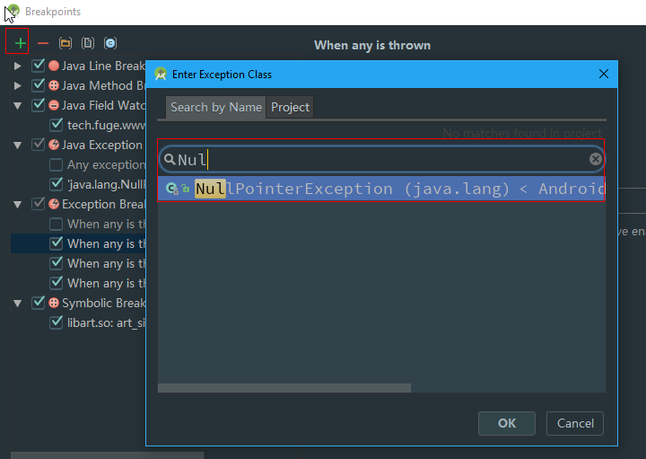
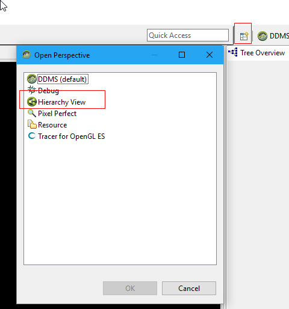

## 《Android群英传 神兵利器》

*世上没有什么事情是不能通过工具来解决的，如果有，那么就创造一个工具去解决*

## 第一章 程序员的小窝--搭建高效的开发环境
- Mac与Android内核都是Unix\Linux架构，不需要安装驱动就可以直接连接
- Mac设置Fn键用作标准功能键
- 基本开发工具Homebrew和Homebrew Cask
- iTerm2终端工具和oh-my-zsh Shell工具
- 用Homebrew安装Git，Java，AndroidStudio等
- 用hexo来搭建个人博客
- 在gitbook上用Markdown写文章

## 第二章 版本控制神器--Git
- SVN是集中式版本管理，若中央服务器出故障或者网络异常，就麻烦了
- Git是分布式版本管理，可以获取到中央服务器的完整信息，不需要频繁通信，只在提交时才要
- Git的基本使用

## 第三章 Android Studio 技巧
- Project和Structure面板
- 在设置的Android Logcat中设置打印日志颜色
- View-Enter Full Screen 全屏模式 减少外部干扰
- 断点调试，异常断点. 在断点中添加Java Exception断点，发生异常时就会定位
- 多语言处理，点击strings.xml右上角的Open editor
- 输入/** 再按Enter 快速生成注释代码
- 自定义Live Templates, 如author声明, 也可以在File and Code Templates设置模版

- Theme Editor 主题右上角点击Open Editor进行编辑

AS快捷键：
Ctrl+H  查看该类的继承关系
Ctrl+O  查看可重写的方法
ctrl+P 查看方法的参数列表
ctrl+F7 查看方法引用的地方
Ctrl + -  方法折叠 展开
ctrl+J 代码模版
ctrl+E 查看最近浏览
Ctrl+Shift+E 查看最近修改
ctrl+shift+A 弹出操作搜索
ctrl+alt+T 弹出Surround With功能，包括一些if try catch语句
ctrl+alt+H 查看方法调用栈
F11 添加书签

## 第四章 与Gradle的爱恨情仇
- Gradle基于DSL语言，如何学习Gradle，在终端输入tree 查看项目结构
- 项目全局的build.gradle， Module build.gradle , apply plugin领域，android领域，dependencies领域
- 核心部分 Gradle Task
- 常用Task命令:assemble task , Check, Build, Clean

## 第五章 深藏功与名的开发者工具
- ADB指令
- Logcat日志系统
- Android Device Monitor
- Hierarchy Viewer就在ADM右上角

- 9Patch工具
- 在手机的开发者选项中开启Shou Layout Bounds查看布局； GPU查看过度重绘

## 第六章 App背后的故事--性能检测和分析工具
- 16ms黄金准则
- Merge和ViewStub
- 内存占用分析和GC系统
- 内存泄漏检测和Dump Heap
- Allocation Tracker
- 用MAT分析内存泄漏，先在Captures中将文件转化为标准的.hprof文件
- 用LeakCanary来分析内存泄漏
- 耗电元凶：Walklocks，AlarmManager，轮询，频繁的网络请求，长时间的CPU占用
- 云测平台：谷歌云测，阿里云测，腾讯优测，Testin

## 第七章 一个人的寂寞与一群人的狂欢
- Chrome开发者工具和插件。 Json-Handler查看Json格式，Octotree方便查看github代码，Request Maker调试后端接口
- Google搜索技巧。 + - OR进行逻辑搜索，*模糊匹配，site指定站点，inurl:pdf 匹配文件格式
- 后端接口测试
- 思维导图工具
- 搜索代码片段的网站 searchcode.com
- github和gitlab 代码托管
- Code Review代码审查
- 自动化测试Monkey,Appium,Robotium,UiAutomator
- Bug管理www.atlassian.com/software/jira
- 文档管理，开源wiki
- Shape生成器 http://shapes.softartstudio.com/
- 工具集合 http://angrytools.com/