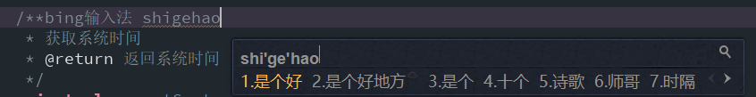

## Android基础
整理通用基础知识

## Base
- 父类定义过的变量，在子类可以直接使用 而不用声明
- String string; 在栈和堆中都没有分配空间
  String string=null; 在栈中分配了空间，在堆中没有分配空间
  String string="";在栈和堆中都分配了空间
- String a="abc";
    String b=new String("abc");
    System.out.println(a==b);
    System.out.println(a.equals(b));
    答案是false true ，  ==比较的是两对象完全相等（值还有hashcode相等），而.equal比较的是值相等
- 像a.equals("Happy new year")这种判断的话如果a为null就会出现异常，但是改成"Happy new year".equals(a)这种写法的话，则即使a为null也不会有问题。所以在Java中进行比较就最好把常量放在左边
- Math.ceil(x/y) 向上取商；Math.floor(x/y) 向下取商
- @Override是伪代码,表示重写(当然不写也可以)，不过写上有如下好处: 
  - 可以当注释用,方便阅读； 
  - 编译器可以给你验证@Override下面的方法名是否是你父类中所有的，如果没有则报错。例如，你如果没写@Override，而你下面的方法名又写错了，这时你的编译器是可以编译通过的，因为编译器以为这个方法是你的子类中自己增加的方法。
- android的xml文件的开头处一般会有 
  xmlns:android=”http://schemas.android.com/apk/res/android” 
  其中xmlns是xml name space的意思。 
  android:id中的android就是在这定义的。可以自己修改，如 
  xmlns:a=”http://schemas.android.com/apk/res/android” 
  然后你就可以放心大胆地写a:id=”@+id/ha”了。  
- 在实际开发中LayoutInflater这个类还是非常有用的，它的作用类似于findViewById()。不同点是LayoutInflater是用来找res/layout/下的xml布局文件，并且实例化；而findViewById()是找xml布局文件下的具体widget控件(如Button、TextView等)
- relativelayout 用这个来居中 要先设置Layout为wrap_content才行 
- 在drawable文件夹右键新建VectorDrawable 就能创建vector图标了 
- JAVA7中增强数字的可读性：1000000.0000 —> 1000_000.000_0 编译器会自动省略_
- 类以代码形式保存在文件中（硬盘中），new一个类，则到内存中了，这就是类的实例化 
- Java文件后缀是.java 编译之后是.class 
## AndroidManifest.xml
- application 标签内加上  android:supportsRtl="true"属性，然后TargetSDK写成17
  由于布局方向可以是从右到左的，所以在写xml布局的时候，为了防止出现布局混乱的现象，不要使用诸如layout_marginRight这种，而应该是layout_marginEnd这种
  
  这样做是为了兼容阿拉伯文，阿拉伯文是一种从右向左书写的文字, 所谓RTL(Right to Left)文字

- android:stateNotNeeded="true"  不保存state状态，即不保留屏幕临时数据
- activity的主题很重要，有时候用的demo 导入后发现样式 字体等变了，很可能就是因为新工程用的不是demo中的主题
- android theme和style的区别 
  theme一般是整个activity的样式，而style一般是一个小部件的样式，如textView，listView等 
  如果theme跟style样式有冲突，一般是style样式优先级高，就近原则

## TextView
xml:
- android:inputType="number"
- android:ems="1" 设置TextView为一列
- android:alpha="0.6" 设置透明度
- textView.append("\n" + msg.obj.toString());  追加消息到TextView中
- 取消默认大写字母android:textAllCaps="false";
- 竖向显示文字，固定几个文字可用\n,  android:text="立\n即\n使\n用"
java:
- tv.setError("报错信息");
- txtShow.setBackground("#000");


## EditText
xml:
- android:ems="1" 设置EditText为一列
- android:background="@null" 消除底部横线
- android:inputType="textMultiLine" 多行显示文字
- EditText挡住ListView的问题，在Manifest中设置Activity属性 android:windowSoftInputMode="stateAlwaysHidden|adjustPan"
- 直接在xml布局中限制输入字符串
  android:digits="qwertyuiopasdfghjklzxcvbnm1234567890"
- TextLayout中显示密码的按钮 app:passwordToggleEnabled="true"
- 有时候不是edittext没有光标，可能是光标默认白色，那么在白色背景下就看不到了 
  方法一、 
  EditText有一个属性：android:textCursorDrawable，这个属性是用来控制光标颜色的 
  android:textCursorDrawable=”@null”，”@null”作用是让光标颜色和text color一样

java:
-  显示小键盘 ((InputMethodManager) getSystemService(INPUT_METHOD_SERVICE)).showSoftInput(editPrivateMsg, 0);
-  隐藏小键盘 ((InputMethodManager) getSystemService(INPUT_METHOD_SERVICE)).
   hideSoftInputFromWindow(editPrivateMsg.getWindowToken(), 0);
- 屏蔽EditText的焦点 etCode.setFocusable(false);
- 点击控件时，重新获取焦点，激活软键盘
- 监听输入edtInput.setKeyListener(DigitsKeyListener.getInstance("1234567890."));
  edtInput.setInputType(8194);

```
  etCode.setFocusable(true);
  etCode.setFocusableInTouchMode(true);
  etCode.requestFocus();
```


## Button
xml:
- 普通Button可以用以下风格实现Material
  style="@style/Widget.AppCompat.Button.Colored"
  Widget.AppCompat.Button.Borderless
  Widget.AppCompat.Button.Colored
  Widget.AppCompat.Button
- 设置Material风格的ImageButton， ImageView，TextView也能用，在某些背景下可能看不出下过，则换一个background，如?attr/selectableItemBackground
```
  <ImageButton
      style="@style/Widget.AppCompat.Button"
      android:layout_width="50dp"
      android:layout_height="wrap_content"
      android:src="@drawable/btn_back_normal"
      android:background="?attr/selectableItemBackgroundBorderless"/>
```

java:


## RadioButtn
- 关于RadioGroup实现多行选项，如两排四列，在选择第一列时，把第二列清空选择即可
  mRg2.clearCheck();


## ScrollView
- 配合TextView来打印日志，自动滚到最底部
```
private void scrollToBottom() {
        scroll.post(new Runnable() {
            public void run() {
                scroll.smoothScrollTo(0, tvLog.getBottom());
            }
        });
    }
```

## AlertDialog
- 点击外部不会关闭dialog, builder.setCancelable(false); 

## ListView
- 长按获取listView的某项值
```
   listview.setOnItemLongClickListener(new AdapterView.OnItemLongClickListener() {
             @Override
             public boolean onItemLongClick(AdapterView<?> parent, View view, int position, long id) {
  str=view.getItemAtPosition(position).toString();
                 TextView text=(TextView)view.findViewById(R.id.text2);
                 String strText=text.getText().toString();
                 Toast.makeText(CodeRecordActivity.this, strText, Toast.LENGTH_SHORT).show();
                 return false;
             }
         });
```

## ImageView
- android:tint="@color/sample_green"
  可以直接给ImageView图片src上色

## Toast
- 一般toast显示不出有3个原因： 
  1、在非UI线程中执行，建议使用handler显示提示 
  2、没有执行到，这是逻辑错误 
  3、可能是手机设置-应用通知管理没打开

## String
- %d（表示整数），%f（表示浮点数）， %s （表示字符串）
  例如 <string name="old">我今年%d岁了</string>
  String sAgeFormat = getResources().getString(R.string.old);
  String sFinalAge = String.format(sAgeFormat, 23);
- toString和 强转(String)的区别。toString是一个方法，任何一个对象都可以有自己的toString方法，而强转String是将一个对象转化为String类型，若本身不是String类型则可能奔溃
- 如果用"."作为分隔的话，必须是如下写法：String.split("\\."),这样才能正确的分隔开，不能用String.split(".");
同理若用"|"作为分隔符的话也一样，因为这是转义字符


## int
- 十进制转化为十六进制，结果为C8。 Integer.toHexString(200);

- 十六进制转化为十进制，结果140。 Integer.parseInt("8C",16);

- res-values-integers.xml, 存放整型数据，strings存放字符串数据


## JavvaDoc注释
- {@link #getBoxStateById(String)}  同类下的方法
  不同类下的 {@link OtherClass#getBoxStateById(String)}


## 四大组件
- Android中的四大组件千万不要通过new的方式创建出来。 会内存泄漏
- 界面跳转和服务的启动都会用到Intent，现在介绍Intent Flag是关于Activity的跳转
  　　Intent intent = new Intent(this,xxx.class);
  　　//如果activity在task存在，拿到最顶端,不会启动新的Activity
  　　intent.addFlags(Intent.FLAG_ACTIVITY_BROUGHT_TO_FRONT);
  　　//如果activity在task存在，将Activity之上的所有Activity结束掉
  　　intent.addFlags(Intent.FLAG_ACTIVITY_CLEAR_TOP);
  　　//默认的跳转类型,将Activity放到一个新的Task中
  　　intent.addFlags(Intent.FLAG_ACTIVITY_NEW_TASK);
  　　//如果Activity已经运行到了顶部Task，再次跳转不会在运行这个Activity
  　　intent.addFlags(Intent.FLAG_ACTIVITY_SINGLE_TOP);
- Android 开发有时需要在一个应用中启动另一个应用，比如Launcher加载所有的已安装的程序的列表，当点击图标时可以启动另一个应用。
  
  一般我们知道了另一个应用的包名和MainActivity的名字之后便可以直接通过如下代码来启动：
```
  Intent intent = newIntent(Intent.ACTION_MAIN);
  intent.addCategory(Intent.CATEGORY_LAUNCHER);          
  ComponentName cn = newComponentName(packageName, className);          
  intent.setComponent(cn);
  startActivity(intent);
```
## fragment
- activity获取fragment中的控件： getFragmentManager().findFragmentById(id).getView().findViewById(id)
- 获取v7包中的fragment： getSupportFragmentManager().findFragmentById(id).getView().findViewById(id)
- fragment获取fragment中的控件： getView().findViewById(id)
  fragment中获取activity中的方法


## View
- view.bringToFront(); 
  将一个控件放在顶层，如progressbar 
- Android UI中的View如何刷新。
  在主线程中  拿到view调用Invalide()方法,查看画画板里面更新imageview的方法
  在子线程里面可以通过postInvalide()方法;
  View view;
  view.invalidate();//主线程
  view.postInvalidate();//子线程


## 布局预览
- 在activity布局中预览fragment效果
  tools:layout="@layout/fragment_main"
  在fragment布局中预览效果，顶部
  tools:showIn="@layout/activity_main"

- RecyclerView预览item元素情况
  tools:listheader="@layout/demo_header"
  tools:listitem="@layout/demo_item"

- TextView等预览
tools:text="预览文字"
tools:visibility= "visible"


## 命名规范
- UI资源命名(最好全用英文命名)
命名规范\
0,大模块名_元素名_状态值
1, 大模块名分为：huanchang, legou , shejiao , xuchang , zhanghu等等
2, 元素名按目前的，如：luyin, bofang , yidian等等
3，状态值， 默认不带；点击变化的状态为 pressed

例子： 
huanchang_yidian 表示欢唱界面 已点图标
huanchang_yidian_pressed 表示欢唱界面 已点图标 ,点击后变化的状态


## 集合
-
	* Collection：代表一组对象，每一个对象都是它的子元素。
	* Set：不包含重复元素的Collection。
	* List：有顺序的collection，并且可以包含重复元素。
	* Map：可以把键(key)映射到值(value)的对象，键不能重复。
	* 数组(Array)和列表(ArrayList)
	* HashSet和TreeSet有什么区别？
	* HashSet是由一个hash表来实现的，因此，它的元素是无序的。add()，remove()，contains()方法的时间复杂度是O(1)。
	* 另一方面，TreeSet是由一个树形的结构来实现的，它里面的元素是有序的。因此，add()，remove()，contains()方法的时间复杂度是O(logn)。

## 多媒体
- 摄像头权限要设置三个
```
    <uses-permission android:name ="android.permission.CAMERA"/>
    <uses-feature android:name="android.hardware.camera" />
    <uses-feature android:name="android.hardware.camera.autofocus" />
```


## 设计模式
- [架构设计](https://github.com/googlesamples/android-architecture)
- MVP：在Android项目中，业务逻辑，数据处理等担任了Model（模型）角色，XML界面显示等担任了View（视图）角色，Activity担任了Contronller（控制器）角色。contronller（控制器）是一个中间桥梁的作用，通过接口通信来协同 View（视图）和Model（模型）工作，起到了两者之间的通信作用。
- 设计原则：(重要) 
  a. 
  逻辑代码独立到单独的方法中，注重封装性–易读，易复用。 
  不要在一个方法中，写下上百行的逻辑代码。把各小逻辑代码独立出来，写于其它方法中，易读其可重复调用。 
  b. 
  写类，写方法，写功能时，应考虑其移植性，复用性：防止一次性代码！ 
  是否可以拿到其它同类事物中应该？是否可以拿到其它系统中应该？ 
  c. 
  熟练运用继承的思想： 
  找出应用中相同之处，且不容易发生变化的东西，把它们抽取到抽象类中，让子类去继承它们； 
  继承的思想，也方便将自己的逻辑建立于别人的成果之上。如ImageField extends JTextField； 
  熟练运用接口的思想： 
  找出应用中可能需要变化之处，把它们独立出来，不要和那些不需要变化的代码混在一起。

## 多线程
- Handler中：myReturnHandler.removeCallbacksAndMessages(null)。null表示将所有的Callbacks和Messages全部清除掉，如
- 关于Handler为何不采用Binder， 先总结说一句，Handler完全可以通过BInder，但是杀鸡焉用牛刀。
  Binder用于进程间通信，而Handler消息机制用于同进程的线程间通信
- 延迟执行
```
  new Handler().postDelayed(new Runnable() {
      @Override
      public void run() {
          pbInit.setVisibility(View.GONE);
      }
  }, 500);
```
- 多线程就是一个人同时在做多件事情，比如同时呼吸和写文章，而多进程就是复制一个人来和你一起做事，两个人之间独立 不冲突


- 关于Handler的实现
    - Looper: 一个线程可以产生一个Looper对象，由它来管理此线程里的Message Queue(消息队列)。
 - Handler: 你可以构造Handler对象来与Looper沟通，以便push新消息到Message Queue里;或者接收Looper从Message Queue取出)所送来的消息。
  - Message Queue(消息队列):用来存放线程放入的消息。
  - 线程：UI thread 通常就是main thread，而Android启动程序时会替它建立一个Message Queue。
  

## 网络编程
- 当我们打开浏览器，在地址栏中输入URL，然后我们就看到了网页。 原理是怎样的呢？ 
  实际上我们输入URL后，我们的浏览器给Web服务器发送了一个Request, Web服务器接到Request后进行处理，生成相应的Response，然后发送给浏览器， 浏览器解析Response中的HTML,这样我们就看到了网页
- HttpURLConnection对象不能直接构造，需要通过URL.openConnection()来获得HttpURLConnection对象，因为HttpURLConnection是抽象类，不能new
- 当用android内的webView打开微博个人页时，显示空白，因为要添加JavaScript脚本支持才行 
  // 得到设置属性的对象 
  WebSettings webSettings = myWeb.getSettings(); 
  // 使能javascript 
  webSettings.setJavaScriptEnabled(true); 
  // 支持中文，否则页面中中文显示乱码 
  webSettings.setDefaultTextEncodingName(“GBK”);
## 异常
- 异常的分类：
  Java.lang.Throwable
  1.Error错误：JVM内部的严重问题。无法恢复。程序人员不用处理。
  2.Exception异常：普通的问题。通过合理的处理，程序还可以回到正常执行流程。要求编程人员要进行处理。
  3.RuntimeException:也叫非受检异常(unchecked exception).这类异常是编程人员的逻辑问题。应该承担责任。Java编译器不进行强制要求处理。 也就是说，这类异常再程序中，可以进行处理，也可以不处理。
  4.受检异常(checked exception).这类异常是由一些外部的偶然因素所引起的。Java编译器强制要求处理。也就是说，程序必须进行对这类异常进行处理
常见异常：
1)非受检的：NullPointerException,ClassCastException,ArrayIndexsOutOfBoundsException,ArithmeticException(算术异常，除0溢出)
2)受检：Exception,FileNotFoundException,IOException,SQLException.


## SQLite数据库
- 调试数据库
```
adb shell  
cd /data/data/tech.fuge.www.forgotfirstlinecode/databases/
sqlite3 myDatebase.db

SELECT DISTINCT 消除重复记录
select * from Book
```
创建数据表，更新数据表
增删改查

1. table 要操作的表名 
2. columns 要查询显示的列名
3. selection  指定where约束条件的列名+条件， 如 item>=
4. selectionArgs  约束条件的值,3+4. 合并为：where column="value"
5. GROUP BY column  指定列来进行分组，将该列一样名字的合并到一个
6. HAVING column="value" 进一步约束
7. ORDER BY column正序排列 从大到小,ORDER BY columnDESC 逆序排列，从小到大
8. LIMIT 6 显示前面多少个
数据库操作写法，一是用Android自带的工具类
二是用一般的数据库写法exc()

insert into Book(name,pages,price,author)  values("作者",103,600,"书名");

- .help 帮助菜单 
  .databases 显示数据库信息； 
  .tables 显示表名称； 
  .schema 命令可以查看创建数据表时的SQL命令； 
  .schema table_name 查看创建表table_name时的SQL的命令； 
  .exit 退出sqlite操作
- 提示 
  Android: adb: Permission Denied 
  执行一下 
  adb root


## NDK开发
- 谈谈对Android NDK的理解。
  native develop kit   只是一个交叉编译的工具  .so
      1.什么时候用ndk,  实时性要求高,游戏,图形渲染,  opencv (人脸识别) , ffmpeg , rmvb  mp5 avi 高清解码. ffmpeg, opencore.

## 性能优化
- Java 内存泄露的根本原因就是 保存了不可能再被访问的变量类型的引用
- 匿名内部类默认持有外部类的引用，有内存泄漏的风险;
- Application对象的生命周期是整个程序中最长的，它的生命周期就等于这个程序的生命周期。因为它是全局的单例的，所以在不同的Activity,Service中获得的对象都是同一个对象。所以可以通过Application来进行一些，如：数据传递、数据共享和数据缓存等操作。
- Java中的卫语句:把嵌套写的if else判断，改为串行的条件判断, return;
- 在BaseActivity中统一开启关闭DEBUG， 还有List<Activity> 管理所有Activity的finish()
- Android oom 1是加载对象过大， 2是相应资源过多，没有来不及释放。
- android new一个类后（如果被context或view等持有的话，会导致无法被GC回收），不用时要手动释放，不然有可能会导致内存泄漏
- Android应用内存泄漏的的原因有以下几个： 
  1查询数据库后没有关闭游标cursor 
  2 构造Adapter时，没有使用 convertView 重用 
  3 Bitmap对象不在使用时调用recycle()释放内存 
  4 对象被生命周期长的对象引用，如activity被静态集合引用导致activity不能释放 
- 资源性对象比如(Cursor，File文件等)往往都用了一些缓冲，我们在不使用的时候，应该及时关闭它们，以便它们的缓冲及时回收内存。它们的缓冲不 仅存在于 java虚拟机内，还存在于java虚拟机外。如果我们仅仅是把它的引用设置为null,而不关闭它们，往往会造成内存泄漏。
- “为什么我们的后台进程/Service会被结束掉？ 
  我想到的是有三个方面： 
  Android系统内存回收机制； 
  各厂商对后台程序的一个管理制度（就是允许程序后台运行那个）； 
  第三方软件的清理(360什么的)。
- 为预防内存泄漏，尽量别把 activity 或 context 设置为静态 static, 对于生命周期长的对象，可以使用 applicationContext

## 测试
- 在移动应用上进行的测试包括：
  
  1. 性能测试: 执行测试客户端的应用程序性能，网络性能和服务器性能。
  2. 功能测试: 这是根据需求检查应用程序功能的基本测试。
  3. 内存测试: 与计算机相比，移动设备具有较小的内存，执行该测试以测试任何应用可优化的存储器使用。
  4. 安装测试: 进行安装测试以检查包括卸载和更新的平滑与容易的安装过程。
  5. 中断测试: 它用于检查由于短信或来电，低电量警告，低内存警告等引起的中断。
  6. 可用性测试: 它用于检查应用程序的有效性，效率和满意度。
  
- 编写测试用例，看输入输出是否正确 
测试用例是软件测试的核心 
测试用例制定的原则 
测试用例要包括欲测试的功能、应输入的数据和预期的输出结果。测试数据应该选用少量、高效的测试数据进行尽可能完备的测试；基本目标是：设计一组发现某个错误或某类错误的测试数据，测试用例应覆盖方面： 
1、 正确性测试：输入用户实际数据以验证系统是满足需求规格说明书的要求；测试用 
例中的测试点应首先保证要至少覆盖需求规格说明书中的各项功能，并且正常。 
2、 容错性（健壮性）测试：程序能够接收正确数据输入并且产生正确（预期）的输出， 
输入非法数据（非法类型、不符合要求的数据、溢出数据等），程序应能给出提示 并进行相应处理。把自己想象成一名对产品操作一点也不懂的客户，在进行任意操作。 
3、 完整（安全）性测试：对未经授权的人使用软件系统或数据的企图，系统能够控制的程度，程序的数据处理能够保持外部信息（数据库或文件）的完整。 
4、 接口间测试：测试各个模块相互间的协调和通信情况，数据输入输出的一致性和正确性。 
5、 数据库测试：依据数据库设计规范对软件系统的数据库结构、数据表及其之间的数据调用关系进行测试。 
6、 边界值分析法：确定边界情况（刚好等于、稍小于和稍大于和刚刚大于等价类边界值），针对我们的系统在测试过程中主要输入一些合法数据/非法数据，主要在边界值附近选取。 
7、 压力测试：输入10条记录运行各个功能，输入30条记录运行，输入50条记录运行。。。进行测试。 
8、等价划分：将所有可能的输入数据（有效的和无效的）划分成若干个等价类。 
9、错误推测：主要是根据测试经验和直觉，参照以往的软件系统出现错误之处。 
10、效率：完成预定的功能，系统的运行时间（主要是针对数据库而言）。 
11、可理解（操作）性：理解和使用该系统的难易程度（界面友好性）。 
12、可移植性：在不同操作系统及硬件配置情况下的运行性。 
13、回归测试：按照测试用例将所有的测试点测试完毕，测试中发现的问题开发人员 
已经解决，进行下一轮的测试。 
14、比较测试：将已经发版的类似产品或原有的老产品与测试的产品同时运行比较，或与已往的测试结果比较

14、A/B测试 
长标题还是短标题 
疑问句还是陈述句 


## Android系统源码

android.googlesource.com：Google官方源码，国内无法直接访问，需要翻墙，对于一个程序员来说具备翻墙的能力是非常有必要的。Android源码中包含的库非常之多，下面列举我在看Android源码过程中涉及较多，也是比较常看的一些库：

android/platform/packages/apps：Android自带的app，比如Email,Camera, Music等，对于应用开发工程师主要关注的目录；
android/platform/frameworks/base： Java framework，这是framework工程师看得最多的目录；
android/platform/frameworks/native：Native framework;
android/platform/art：Art虚拟机;
android/kernel/common：Android内核，这是驱动工程师最关注的模块；
android/platform/system/core ：核心系统;
android/platform/libcore：平台的lib库;


## 关于APK签名
- APK签名用处主要有两种 
  a. 使用特殊的key签名可以获取到一些不同的权限。 
  b. APK如果使用一个key签名，发布时另一个key签名的文件将无法安装或覆盖老的版本，这样可以防止你已安装的应用被恶意的第三方覆盖或替换掉
- 包名不同则相当于两个应用，若包名相同而签名不同则无法安装，若包名和签名都相同，则可以覆盖安装
- 包名一般选用自家域名的倒装
- 直接查看签名文件 keytool -list -keystore E:\Trinea\keystore\appsearch.keystore （不够全）
- .推荐：解压APK后 进入META-INF文件夹， cmd输入   keytool -printcert -file CERT.RSA   
- android Your keystore contains 2 entries  一个签名文件可以包含多个别名，不同别名签名后的MD5不同，可以覆盖安装？？（不能，别名不同也不算同一个key），但微信支付就会失败，所以要注意用同一个别名

## 简称
- SNS，全称Social Networking Services，即社会性网络服务
- HAL（Hardware Abstract Layer硬件抽象层）
- OpenGL（全写Open Graphics Library）是个定义了一个跨编程语言、跨平台的编程接口规格的专业的图形程序接口；
- 位置服务(LBS,Location Based Services)；
- OOM - Out of Mana，法力耗尽 
- OOM - Out of Memory，内存溢出
- Hotfix是针对某一个具体的系统漏洞或安全问题而发布的专门解决该漏洞或安全问题的小程序，通常称为修补程序。
- JSON(JavaScript Object Notation) 是一种轻量级的数据交换格式 
- AJAX即“Asynchronous javascript And XML”（异步JavaScript和XML），是指一种创建交互式网页应用的网页开发技术。
- SYN(synchronous):TCP/IP建立连接时使用的握手信号 同步 
- ACK(Acknowledgement):确认字符，确认发来的数据已经接受无误 确认
- SVG 指可伸缩矢量图形 (Scalable Vector Graphics)
- SSH 为 Secure Shell 的缩写,为建立在应用层和传输层基础上的安全协议。
- APK是AndroidPackage的缩写，即Android安装包(apk)
- USB-OTG线 接鼠标操作手机
- API（Application Programming Interface,应用程序编程接口）是一些预先定义的函数，目的是提供应用程序与开发人员基于某软件或硬件得以访问一组例程的能力，而又无需访问源码，或理解内部工作机制的细节。
- GMS全称为Google Mobile Service，即谷歌移动服务。GMS是Google开发并推动Android的动力，也是Android系统的灵魂所在。
- 物料清单(Bill of Material,BOM)
- .so ， shared object，用户层的动态库 。
- ANR：Application Not Responding
- JNI（java native interface java 本地接口）
- ARP(Address Resolution Protocol，地址解析协议)是获取物理地址的一个TCP/IP协议 
  ARP欺骗可以导致目标计算机与网关通信失败； 
- MIME 是multipurpose Internet mail extensions 的缩写。 
它是一种协议，可使电子邮件除包含一般纯文本以外，还可加上彩色图片、视频、声音或二进位格式的文件。 
它要求邮件的发送端和接收端必须有解读MIME 协议的电子邮件程序。
- OA :Office Automation System 办公自动化系统 
 
## 工具&&网站
- 自动获取shape  http://shapes.softartstudio.com/#&ui-state=dialog

- 输入法推荐bing拼音输入法,能跟随AndroidStudio的光标移动,再切换到暗黑边界主题。 会导致Alt+Tab切换标签失败，不要用



- 『我从不畏惧一个知道一万种踢法的人，但是我害怕一个把一种踢法练习过一万次的对手。』

## 其他


- 图片、文字在网络传送中是转换成一定的二进制代码进行传送的。（图片、文字等--→传送端（发出）--→图片数据转换器（把图片和文字转换成0、1代码）--→终端（接收）--→图片数据转换器（将0、1代码转换成图片和文字）--→图片、文字。）
- 传输过程中是二进制的，但物理上表示的方式不同。光纤用光信号的亮与不亮来表示1和0，电信号用高低电平来表示二进制！

- **Applet和普通的Java应用程序有什么区别？**
  applet是运行在启用了java的浏览器中，Java应用程序是可以在浏览器之外运行的独立的Java程序。但是，它们都需要有Java虚拟机。
  进一步来说，Java应用程序需要一个有特定方法签名的main函数来开始执行。Java applet不需要这样的函数来开始执行。
  最后，Java applet一般会使用很严格的安全策略，Java应用一般使用比较宽松的安全策略。
- **数据库连接池是什么意思？**
  像打开关闭数据库连接这种和数据库的交互可能是很费时的，尤其是当客户端数量增加的时候，会消耗大量的资源，成本是非常高的。可以在应用服务器启动的时候建立很多个数据库连接并维护在一个池中。连接请求由池中的连接提供。在连接使用完毕以后，把连接归还到池中，以用于满足将来更多的请求。
- **什么是cookie？session和cookie有什么区别？**
  cookie是Web服务器发送给浏览器的一块信息。浏览器会在本地文件中给每一个Web服务器存储cookie。以后浏览器在给特定的Web服务器发请求的时候，同时会发送所有为该服务器存储的cookie。下面列出了session和cookie的区别：

  	* 无论客户端浏览器做怎么样的设置，session都应该能正常工作。客户端可以选择禁用cookie，但是，session仍然是能够工作的，因为客户端无法禁用服务端的session。
  	* 在存储的数据量方面session和cookies也是不一样的。session能够存储任意的Java对象，cookie只能存储String类型的对象。

- 三色规律PS：主色占60%，剩余两色分别为30%和10%。 
  就好比男人的西装外套和裤子占了装配的60%，衬衫占30%，剩下的10%留给领带点缀
- 一个 Android 工程最后变成 apk 包大概要做这么几件事儿：
  
  * 1、生成 R.java 文件
  * 2、将 .java 文件编译成 .class 文件
  * 3、将 .class 文件打包成 .jar 文件
  * 4、将所有 .jar 文件（包括依赖库）编译成 classes.dex 文件
  * 5、将 assets 和 res 文件夹中所有的资源文件打包成一个 apk 包
  * 6、将 classes.dex 文件添加进 apk 包
  * 7、如果有使用 NDK 技术的话，将生成的 .so 文件添加进 apk 包
  * 8、对 apk 包进行签名
  
- android 定义颜色color时6位或8位值的区别
  
  6位（#000000）就是RGB值（红绿蓝各自0~255，转换为16进制后，各对应前两位数，0~f）
  8位（#1e000000）头两位是透明度，后6位是RGB值，00是完全透明，ff是完全不透明，比较适中的透明度值是 1e 3e 4e
  
- 如何将一个Activity设置成窗口的样式。 
  答：中配置：android :theme=”@android:style/Theme.Dialog” 
  另外android:theme=”@android:style/Theme.Translucent” 是设置透明
  
- 公钥和私钥是成对的，它们互相解密。 
  公钥加密，私钥解密。 
  私钥数字签名，公钥验证。 
  RSA是目前最有影响力的公钥加密算法，它能够抵抗到目前为止已知的所有密码攻击，已被ISO推荐为公钥数据加密标准。 
  RSA算法基于一个十分简单的数论事实：将两个大素数相乘十分容易，但那时想要对其乘积进行因式分解却极其困难，因此可以将乘积公开作为加密密钥。
  
- 人工画的二维码也能识别的，要分好格子来画，二维码有一定容错性，一般遮住一小部分仍然能识别  